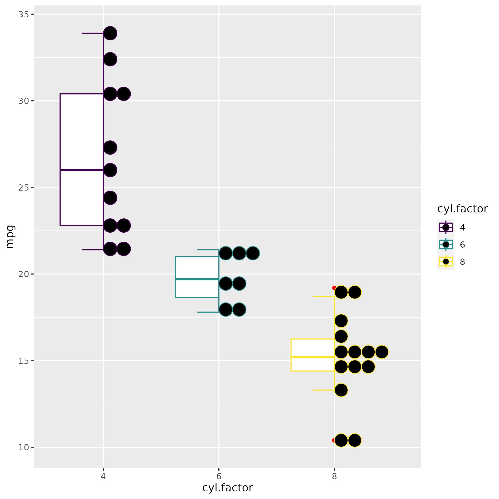
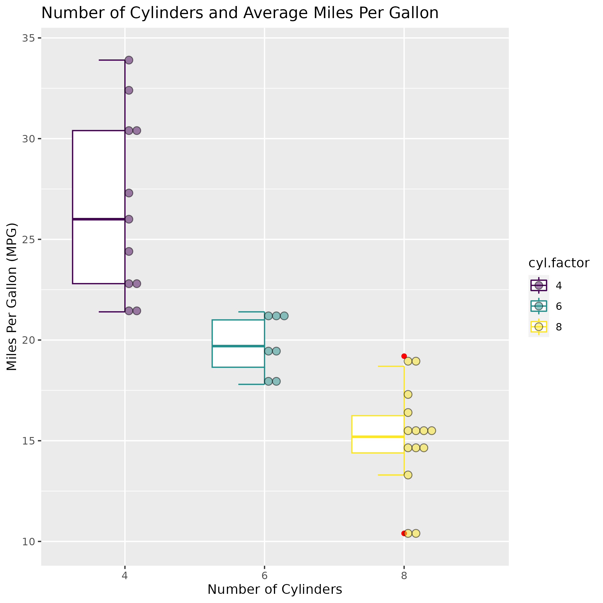

```{r setup, include=FALSE}
knitr::opts_chunk$set(echo = FALSE)
```

## Half Boxplot and Half Dotplot

For my GGHalves demonstration we used the `mtcars` dataset, to help explain how we can create this informative data visualizations. 

The basic dotplot we created initially was the following:

```{r, out.width="50%"}
#basic <- ggplot(mtcars, aes(x = cyl.factor, y = mpg, color = cyl.factor)) + 
  #geom_half_boxplot() + geom_half_dotplot()
```


Although we can see the outliers a bit because of the color, it is still hard to really see. We can change the size of the dotplot points and the transparency to see both dotplot points and the outliers.  

```{r, out.width="50%"}
#ggplot(mtcars, aes(x = cyl.factor, y = mpg, color = cyl.factor)) +
  #geom_half_boxplot(outlier.color = "red") +
  #geom_half_dotplot()
```



Considering it is hard to see the outliers, because the size and color of the `half_geom_dotplot`, we can adjust those elements to make the outliers even more visible for the viewers.

```{r, out.width="50%"}
#ggplot(mtcars, aes(x = cyl.factor, y = mpg, color = cyl.factor)) + 
  #geom_half_boxplot(outlier.color = "red") +
  #geom_half_dotplot(dotsize = .50, color = "black", alpha = .5)
```


Lastly, to ensure our viewers can fully understand the visualization, we must add our axes labels and a title.

```{r}
#ggplot(mtcars, aes(x = cyl.factor, y = mpg, color = cyl.factor)) + geom_half_boxplot(outlier.color = "red") +
  #geom_half_dotplot(aes(fill = cyl.factor), dotsize = .50, color = "black", alpha = .5) +
  #labs(
    #x = "Number of Cylinders",
    #y = "Miles Per Gallon (MPG)",
    #title = "Number of Cylinders and Average Miles Per Gallon"
  #)
```

